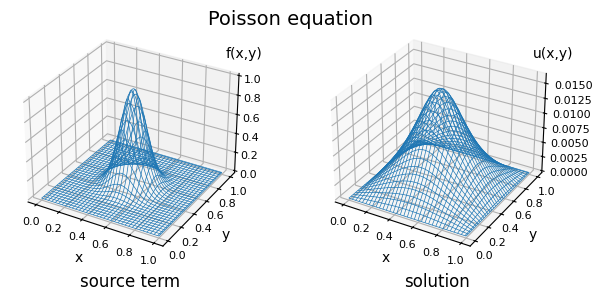

fem2dsimple
=============

`fem2dsimple` is a simple Python solver for the 2D Poisson equation.  The solution is computed over a rectangular mesh, with Dirichlet boundary conditions.

Minimal theory
--------------
The Poisson equation with Dirichlet boundary conditions is given by

```math
\begin{align*}
\nabla^2 u(x,y) = f(x,y) \quad & \forall (x,y) \in \Omega := [0,L_x] \times [0,L_y], \\
u(x,y) = 0               \quad & \forall (x,y) \in \partial\Omega,
\end{align*}
```

where $f$ is the inhomogeneity and $u$ the unknown.  By means of partial integration and with the definition of a basis set $\{v_i\}$, the problem can be recast as a linear system,

$$
\sum_j A_{ij} u_j = b_i
$$

with $A_{ij} = \int_\Omega \nabla v_i(x,y) \nabla v_j(x,y) \mathrm d\sigma$, known as the *stiffness matrix*; and $b_i = \int_\Omega f(x,y) v_i(x,y) \mathrm d\sigma$.

`fem2dsimple` uses triangular elements to discretize the rectangular domain, and piece-wise linear polynomials as a basis set.  Each basis function $v_i$ is defined in the neighborhood of the $i$-th node and is constrained to have compact support: namely, it equals 1 on the $i$-th node and vanishes on the neighbouring nodes.

Minimal example
---------------
To solve the Poisson equation with `fem2dsimple`, you need to specify your problem first: namely, you need to define the inhomogeneity $f(x,y)$.  Begin by defining your function of interest:


```python
import numpy as np

# define a 2D gaussian function, p = [(x0,y0), (x1,y0), ...]
def f(p):
    sigma_x = 0.01
    sigma_y = 0.01
    x0      = 0.5
    y0      = 0.5
    N       = 1.0
    return N * np.exp(-((p[...,0]-x0)**2/(2.0*sigma_x) +
                        (p[...,1]-y0)**2/(2.0*sigma_y)))
```

To solve the problem defined by this function, import the `fem2d` module and create a mesh:


```python
import fem2d as fem

Nx = 100    # number of rectangular mesh subdivisions in x
Ny = 100    # number of rectangular mesh subdivisions in y
Lx = 1.0    # x length of mesh rectangle
Ly = 1.0    # y length of mesh rectangle

# N.B.: each rectangular subdivision contains two elements (right-angled
# triangles), like so:
#
#  _ _!____!_ _
#     |   /|
#     |  / |
#     | /  |
#  _ _|/___|_ _
#     !    !
#

mesh = fem.TriangularMesh2D(Nx, Ny, Lx, Ly)
mesh.nodes
```


    array([[0.  , 0.  ],
           [0.01, 0.  ],
           [0.02, 0.  ],
           ...,
           [0.98, 1.  ],
           [0.99, 1.  ],
           [1.  , 1.  ]])


Generate the coefficients matrix $A$ (i.e. the stiffness matrix) and the constants vector $b$ of the linear system:


```python
A_mat = fem.stiffn(mesh)
b_vec = fem.fv_int(mesh, f)
```

Since $A$ is a banded matrix, `fem2d.stiffn` by default returns a matrix in [diagonal ordered form](https://docs.scipy.org/doc/scipy/reference/generated/scipy.linalg.solve_banded.html), as accepted by the `scipy.linalg.solve_banded` solver:


```python
A_mat
```


    matrix([[ 0. ,  0. ,  0. , ..., -1. , -1. , -0.5],
            [ 0. ,  0. ,  0. , ...,  0. ,  0. ,  0. ],
            [ 0. ,  0. ,  0. , ...,  0. ,  0. ,  0. ],
            ...,
            [ 0. ,  0. ,  0. , ...,  0. ,  0. ,  0. ],
            [ 0. ,  0. ,  0. , ...,  0. ,  0. ,  0. ],
            [-0.5, -1. , -1. , ...,  0. ,  0. ,  0. ]])


Before solving the system efficiently with the `scipy.linalg.solve_banded` solver,  you need to retrieve the numbers of non-zero upper and lower diagonals of $A$.  The two happen to coincide ($A$ is symmetric) and be equal to the number of nodes in a row of the mesh, which is stored in the `fem2d.TriangularMesh2D` type as `nx`:


```python
nx = mesh.nx
nx
```


    101


Now you're all set to fire up `scipy.linalg.solve_banded`:


```python
from scipy.linalg import solve_banded
u = solve_banded((nx,nx), A_mat, b_vec)
```

The solution is now ready to plot:


```python
import matplotlib.pyplot as plt
%matplotlib inline

# prepare (x,y) grid
nx, ny, nodes = mesh.nx, mesh.ny, mesh.nodes
X = nodes[:,0].reshape(nx,ny)
Y = nodes[:,1].reshape(nx,ny)

fig = plt.figure(figsize=(6.4, 3.0))
fig.suptitle("Poisson equation", y= 0.95, fontsize=14)

# first subplot: f(x, y), inhomogeneity of the Poisson equation
Z = f(nodes).reshape(nx,ny)

ax = fig.add_axes((0.0, 0.13, 0.5, 0.8), projection='3d')
ax.set_title("inhomogeneity", y=-0.15)
ax.tick_params(labelsize=8, pad=-2)
ax.set_xlabel('x', labelpad=-4)
ax.set_ylabel('y', labelpad=-4)
ax.text2D(0.90, 0.85, "f(x,y)", transform=ax.transAxes)
ax.plot_wireframe(X, Y, Z, cstride=5, rstride=5, linewidths=0.5)

# second subplot: u, solution of the linear system
Z = u.reshape(nx,ny)

ax = fig.add_axes((0.48, 0.13, 0.5, 0.8), projection='3d')
ax.set_title("solution", y=-0.15)
ax.tick_params(labelsize=8, pad=-2)
ax.tick_params('z', pad=4)
ax.set_xlabel('x', labelpad=-4)
ax.set_ylabel('y', labelpad=-4)
ax.text2D(0.90, 0.85, "u(x,y)", transform=ax.transAxes)
ax.plot_wireframe(X, Y, Z, cstride=5, rstride=5, linewidths=0.5)

# plt.savefig("poisson.png")
plt.show()
```


    

    


In the long range, the solution of the Poisson equation with a gaussian inhomogeneity should resemble $\sim 1/r$, with $r=\sqrt{(x^2+y^2)}$: this goes to zero more slowly than a gaussian function (the latter decaying exponentially).  Here you can tell that $u(r)$ does indeed go to zero more slowly than $f(r)$.  
